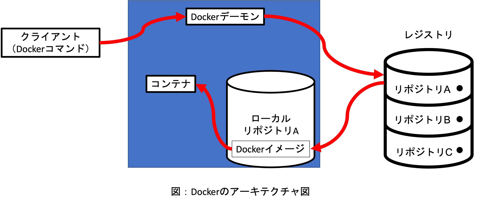

# webapps入門
自分用備忘録．
## 目次
 - [1. 使う言語とかフレームワークとか](#1.使う言語とかフレームワークとか)   
 - [2.git](#git)
    - [2.1 gitによるversion管理](#2.1gitによるversion管理)
    - [2.2 HEADとmasterについて](#2.2HEADとmasterについて)
    - [2.3リモートリポジトリにローカルリポジトリを紐づける](#2.3リモートリポジトリにローカルリポジトリを紐づける)
 - [3.DockerとKubernetes](#3.DockerとKubernetes) 
    - [3.1 Kubernetesアーキテクチャ](#K3.1ubernetesアーキテクチャ)
    - [3.2 コンテナ](#3.2コンテナ)
    - [3.3 Docker](#3.3Docker)
      - [3.3.1 Dockerデーモン](#3.3.1Dockerデーモン)
      - [3.3.2 Dockerクライアント](#3.3.2Dockerクライアント)
      - [3.3.3 Dockerイメージ](#3.3.3Dockerイメージ)
      - [3.3.4 Dockerコンテナ](#3.3.4Dockerコンテナ)
      - [3.3.5 レジストリ](#3.3.5レジストリ)  
    - [3.4 Dockerを起動する](#3.4Dockerを起動する) 
    - [3.5 DOckerイメージをコンテナへ変換する](#3.5DOckerイメージをコンテナへ変換する)
    - [3.6 Dockerイメージからビルドしてコンテナとして実行](#3.6Dockerイメージからビルドしてコンテナとして実行)
    - [3.7 Dockerファイルを書いてNext.js+Typescript環境を構築](#3.7Dockerファイルを書いてNext.js+Typescript環境を構築)
## 1.使う言語とかフレームワークとか
`docker+kubernetes` 

`typescript+node.js+Next.js`

~~`typescript+react.js`~~

こいつらで開発をしてみる
(2024/05/14追記)
マルチステージビルドで行う．
dev環境，build環境，本番環境の３つ
Dockerfileを簡素化させるためにdocker-composeも使っていく．

## 2.git

### 2.1gitによるversion管理
おいおい書いていく．
ひとまず，`git init`でローカルリポジトリを初期化して，リモートリポジトリに紐づける．
```
webapps_tutorial/
┣━.git
┣━.gitignore
┣━まとめ.md
┣━
┗━
```
[ファイル名]の最終のコミットにチェックアウト
```
git checkout -- [ファイル名]
```

### 2.2HEADとmasterについて

HEADは自分が今見ているコミットを指すポインタ．
[ブランチ名]は最新のコミットを指すポインタ．
下記でどのコミットを指しているか見れる．
```
git rev-parse [HEAD or master]
```

```
commit1(aaa)
┃
commit2(aab)
┃
commit3(aac)
┃
commit4(aba)
┣━━━━━━━━━━━━commit5(abb)
commit6(abc) ┃
┃            commit8(acb) <-dev
commit7(aca) <-master <-HEAD
```

なお，`checkout`は作業ディレクトリに対象ブランチの内容を取り込むことを指す．（HEADも対象ブランチを指すポインタになる）
（masterを指定すれば，commit7のブランチの内容を取り込むし，devを指定すればcommit8, commit4をSHA1IDかタグで指定すればその内容を取り込む）

#### ブランチ名の変更
パワープレイだが，ブランチを新たに切って，削除すれば良さげ

`git branch [名前変更後のブランチ名]`

`git branch -d [削除したブランチ名]`

### 2.3リモートリポジトリにローカルリポジトリを紐づける

`git remote add [どんな名前にするか] [リモートリポジトリの場所]`
別のリモートリポジトリ（hoge.gitだけでなく）を紐づけることもできる．（＝別のローカルリポジトリをリモートにもできる）
例えば，自分が持っているサーバーにgitリポジトリを作成して，そこへのアドレスをoriginとして登録することで紐づけられる（cloneしても良いと思うが）

いよいよpushしようとしてみたら，こんなことが．
```
hint: Updates were rejected because the tip of your current branch is behind
hint: its remote counterpart. Integrate the remote changes (e.g.
hint: 'git pull ...') before pushing again.
hint: See the 'Note about fast-forwards' in 'git push --help' for details.
```

おそらく，origin/mainをpullせずに行ったためこんなエラーが出た．
そのため，origin/mainをpull(fetch+merge)．
が，できない．

```
fatal: refusing to merge unrelated histories
```
と怒られてしまう．

今回，すでにremoteで作ってあったmainブランチに，後で作成したlocalのmainブランチをpushしようとしたことがおそらく原因．
remoteのrootとlocalのrootが違うことが原因．
簡単な解決策は，
1. localに`git fetch origin main`をした後に，g`it merge --allow-unrelated-histories origin/main`をして，rootを無視してorigin/mainにつなげちゃう
2. 名前を変えて，リモートリポジトリ内でmainにマージ（pull）する

## 3.DockerとKubernetes

スマートフォンアプリなど，高いスケーラビリティを維持するために用いるプラットフォーム．
CI/CD実践の課題解決をサポートする．

よーするに？→大規模開発向けのコンテナマネジメントツール的な？
→むしろ，サーバーマネジメントの側面が強いか．

### 3.1Kubernetesアーキテクチャ
マスターがノード（サーバー）をコントロール・モニタリングして，ノードがコンテナの実行環境となる

### 3.2コンテナ
OSSの開発では，バージョンアップ，バグフィックス，セキュリティパッチなどの更新が日々行われている．
その結果，依存関係のあるライブラリやソフトウェアが時間経過とともに，予期した動作をしないことがある．
そこで，開発を安定化させるためにこのコンテナ技術が開発された．

コンテナはLinux上で動作する，mac，windowsの場合は
1. 仮想サーバー（LinuxKit: 軽量化・セキュアなlinuxOS）を立てる
2. コンテナを起動する
という流れ．

そして，コンテナはDockerDaemonによって管理される．

### 3.3Docker
Dockerのアーキテクチャ



構成要素
1. Dockerデーモン
2. Dockerクライアント
3. Dockerイメージ
4. Dockerコンテナ
5. レジストリ

#### 3.3.1Dockerデーモン
Dockerデーモンは，クライアント（Dockerコマンド=docker run ~的なやつ）の要求を受け取り，イメージ・コンテナ・ボリューム・ネットワークといったDockerオブジェクトを管理する．

#### 3.3.2Dockerクライアント
Dockerコマンドのこと．DockerAPIを利用してDockerデーモンへ要求を送り，機能を活用できるようにする．
(ex) 
```
docker build: ベースのイメージから，機能を加えた新イメージをビルドする
docker pull: レジストリのイメージをローカルにダウンロードする　
docker run: イメージからコンテナを実行する．
``` 

#### 3.3.3Dockerイメージ
読み取り専用のコンテナのテンプレートのこと．すなわち，イメージはコンテナを起動するための実行形式と設定ファイルなどのかたまりのこと．イメージをもとにして，コンテナを実行し，ミドルウェアやアプリケーションなどを実行する．

#### 3.3.4Dockerコンテナ
コンテナ（プロセスともいう）は名前空間やコントロールグループなどによって他のプロセスから分離された実行状態のプロセス．
イメージの実行可能インスタンス．`docker run`コマンドでイメージはコンテナに変換され，インスタンス化される．

#### 3.3.5レジストリ
Dockerイメージを補完する．デフォルトでは，Docker Hubにあるイメージを探す，

補足（後で書く）
名前空間（ネームスペース）

### 3.4Dockerを起動する
Docker for Desktopを起動すれば，linuxVMおよびdocker daemonが起動しdockerコマンドが使えるようになる．

~~もしくは，`sudo dockerd`でdocker daemonとlinuxVM起動，`sudo systemctl stop docker`で終了する．~~

（追記）
上記はlinuxでのみ可能（参照[Docker Daemon command dockerd not found on latest stable Docker for Mac and Docker Toolbox](https://github.com/moby/moby/issues/27102)）．mac OSではdocker daemonを起動するのはdocker for Desktopのみ．

### 3.5DOckerイメージをコンテナへ変換する
`docker run hello-world`とコマンドを入力

下記メッセージが出ればおk（イメージを取ってくるところから，このメッセージが送られるところまでのフローを教えてくれる）
```
To generate this message, Docker took the following steps:
 1. The Docker client contacted the Docker daemon.
 2. The Docker daemon pulled the "hello-world" image from the Docker Hub.
    (arm64v8)
 3. The Docker daemon created a new container from that image which runs the
    executable that produces the output you are currently reading.
 4. The Docker daemon streamed that output to the Docker client, which sent it
    to your terminal.
```

### 3.6Dockerイメージからビルドしてコンテナとして実行
ベースイメージ（OSやらプログラミング言語やら．）
プログラミング言語などは，元々のdocker daemonを起動したlinuxVM環境内で使うらしい．

DockerFileの書き方
```DockerFile
FROM alpine:latest
RUN apk update && apk add figlet
ADD ./message /message
CMD cat /message | figlet
```

`FROM`はどのイメージを持ってくるか.
`RUN`は`FROM`のベースイメージ上で実行するコマンド
`ADD [SOURCE] [TO]`はローカルホスト上のファイルをどこに配置するか
`CMD`はコンテナの実行時に実行されるコマンドを指定

Dockerfileからイメージをビルド
```
docker build --tag [image]:[tag] [path]
```

複数のイメージをビルドして，コンテナ間で連携する場合はdocker-composeを用いて，yamlファイルも書く

### 3.7Dockerファイルを書いてNext.js+Typescript環境を構築

```
FROM node:18-alpine
WORKDIR /app

# TypeScriptとcreate-next-appをインストール
RUN npm install -g typescript create-next-app

# Next.jsアプリケーションを作成
RUN npx create-next-app@latest my-app --typescript

# 作成したNext.jsアプリケーションのディレクトリに移動
WORKDIR /app/my-app

# 必要なパッケージのインストール
RUN npm install

# Dockerイメージのポートを公開（必要に応じて）
EXPOSE 3000

# コンテナ起動時にshellに入る
CMD /bin/sh
```
これでビルドはできてコンテナが起動し，shellに入る．

その後は，
```
npm run dev
```
のコマンドでサーバーが立ち上がる．

(2024/05/14追記)
どーやら一発コマンド
RUN npx create-next-app@latest my-app --typescriptはDockerfileのRUNでは動作しないっぽい．
やるなら，一度立てた後で上記を実行．
そうすればnext appができあがる．
volumeとかはどうするの？→-vオプションをつけてrunする
諸々のオプションつけてやるのだるいから,composeがあるのかなって感じ．
`npx create-next-app@latest my-app --typescript`のコマンドはインタラクティブなプロンプトが必要になるので，期待通りの動作をしないっぽい．

### 3.8compose.yaml（V2）の書き方
yamlファイルはdockerだけじゃなくて，何らかの設定を記述したテキストファイル．
dockerで用いる場合は，複数のコンテナをイメージからビルドするときに使う．
例えば，dbのコンテナイメージとwebappのコンテナイメージをビルドする場合とかね．
一つだけならDockerfileからビルドしても良い．

例えば研究で使うpython環境とかだとDockerfileからビルドしちゃう方がいいかなと思う．

要素（element）
- `version`：後方互換性のためにあるが今後廃止予定（非推奨）
- `name`：こちらを使う，プロジェクト名を記述しておく．
- `service`: ステージの管理単位．テストとかリリースのステージをDockerfileからビルドできる．

```yaml
name: myapp

services:
  foo:
    image: busybox
    command: echo "I'm running ${COMPOSE_PROJECT_NAME}"
```
- `volumes`: [ホスト側の相対Path]:コンテナの絶対Pathと記述
名前付きボリュームについて．
ボリュームの実体は`/var/lib/docker/volumes/$VOLUME_NAME/_マウント先ディレクトリ名`にある．
直接，ディレクトリを指定してマウントする方法もある．

### プロジェクトrの作せi
npx create-next-app webapp --ts --eslint --tailwind --no-app --no-src-dir --import-alias '@/*'

or

npx create-next-app@latest webapp

イメージからコンテナ作成＆実行
（使わないコンテナは定期的に破棄or--rmで消しながら．）
docker compose start は再起動

portを指定する必要あり．
docker-compose run -p 3000:3000 webapp-dev

